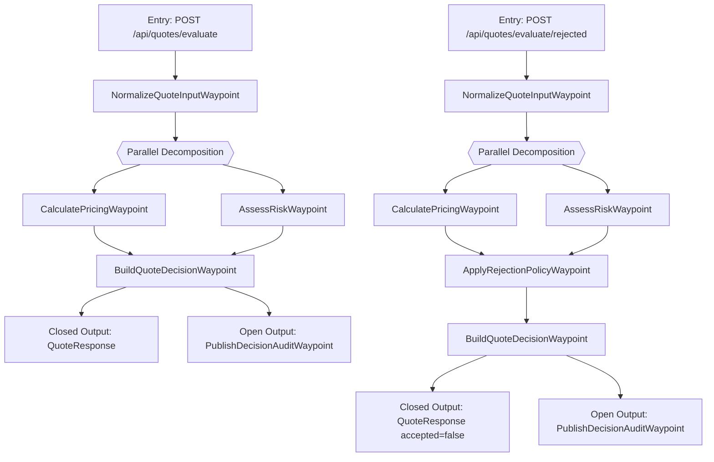

# Quote Evaluation Flow (Decomposition-Based)

```mermaid
flowchart TD
    A[Entry: POST /api/quotes/evaluate] --> B[NormalizeQuoteInputWaypoint]
    B --> C{{Parallel Decomposition}}
    C --> D[CalculatePricingWaypoint]
    C --> E[AssessRiskWaypoint]
    D --> F[BuildQuoteDecisionWaypoint]
    E --> F
    F --> G[Closed Output: QuoteResponse]
    F --> H[Open Output: PublishDecisionAuditWaypoint]

    A2[Entry: POST /api/quotes/evaluate/rejected] --> B2[NormalizeQuoteInputWaypoint]
    B2 --> C2{{Parallel Decomposition}}
    C2 --> D2[CalculatePricingWaypoint]
    C2 --> E2[AssessRiskWaypoint]
    D2 --> P[ApplyRejectionPolicyWaypoint]
    E2 --> P
    P --> F2[BuildQuoteDecisionWaypoint]
    F2 --> G2[Closed Output: QuoteResponse accepted=false]
    F2 --> H2[Open Output: PublishDecisionAuditWaypoint]
```
